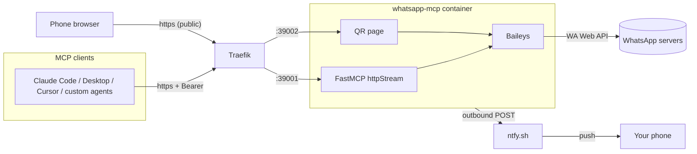

# WhatsApp MCP Server

[](https://github.com/eusoubrasileiro/whatsapp-mcp/actions/workflows/ci.yml)

WhatsApp as an MCP server. Runs as a long-lived Docker daemon, accessed over HTTPS with Bearer auth, and pushes [ntfy](https://ntfy.sh) notifications when your session needs attention (QR expired, connection dropped). Built on [Baileys](https://github.com/WhiskeySockets/Baileys) via the [`@amiticia/baileys-client`](https://github.com/eusoubrasileiro/baileys-client) wrapper.

## Who this is for

You want your personal WhatsApp account reachable as a set of tools from **Claude Code, Claude Desktop, Cursor, or any custom MCP/HTTP client** — from any machine — with the WhatsApp connection surviving client restarts, multiple clients sharing one socket, and a push telling you on your phone when you need to re-scan a QR.

## Features

- **HTTP MCP endpoint** (`httpStream` transport) — connect from anywhere, share the session across multiple clients without Baileys fighting for the socket
- **Bearer-token auth** on the MCP endpoint
- **Public QR web page** (protected by paired-number check) — tap the ntfy push and scan directly from your phone browser
- **ntfy push** on: first QR after disconnect, every 2min while still waiting, connection drop, reconnect after drop, and unexpected pairings
- **Bad-pairing protection** — if someone else scans the public QR, the app auto-logs out and purges credentials (`EXPECTED_WA_NUMBER`)
- **23 MCP tools** — search contacts/messages, list chats, send text/media, react, delete, mark read, download media, plus reactive monitoring (cursor delta, long-poll, a `follow_chat` WebSocket stream) and webhook subscriptions for real-time inbound push (see table below)
- **Persistent SQLite** (chats/messages/contacts) and Baileys multi-file auth stored in a Docker volume
- **Optional multi-account gateway** (`pnpm start:gateway`) — one MCP server fronting several WhatsApp accounts, each still its own isolated process (own socket, DB, send limits); every tool takes a required `account`. See [`docs/configuration.md`](./docs/configuration.md#multi-account-gateway).

## Architecture




One container exposes two HTTP servers on different ports. Traefik terminates TLS (Let's Encrypt) and routes by hostname.

## Quick start for MCP clients

A deployment exposes two hostnames of your choosing (`example.com` below — substitute your own):

- `https://mcp.example.com/mcp` — MCP endpoint, requires `Authorization: Bearer <MCP_AUTH_TOKEN>`
- `https://wa.example.com/` — QR web page

### Claude Code

Edit `~/.claude.json`, in the top-level `mcpServers` object:

```json
"whatsapp": {
  "type": "http",
  "url": "https://mcp.example.com/mcp",
  "headers": {
    "Authorization": "Bearer ${MCP_AUTH_TOKEN}"
  }
}
```

Export `MCP_AUTH_TOKEN` in your shell (or put the token literally — `~/.claude.json` is `0600`). Restart Claude Code, run `/mcp` — should show `whatsapp: ✓ Connected`.

### Claude Desktop

`~/.config/Claude/claude_desktop_config.json` (Linux) / `~/Library/Application Support/Claude/claude_desktop_config.json` (macOS):

```json
{
  "mcpServers": {
    "whatsapp": {
      "type": "http",
      "url": "https://mcp.example.com/mcp",
      "headers": { "Authorization": "Bearer your-token-here" }
    }
  }
}
```

### Cursor

`~/.cursor/mcp.json` — same shape as Claude Desktop above.

### Other clients / custom code

See [`examples/`](./examples/) for a raw HTTPS JSON-RPC transcript (curl), a Python client, and a custom TypeScript agent using `StreamableHTTPClientTransport`.

## MCP tools

The server exposes 23 tools. Full reference: [`docs/tools.md`](./docs/tools.md).

| Category | Tools |
|----------|-------|
| Connection / Auth | `get_connection_status`, `logout` |
| Contacts | `search_contacts`, `list_contacts` |
| Messages | `list_messages`, `get_messages_today`, `search_messages`, `get_message_context` |
| Reactive monitoring | `get_new_messages` (cursor delta), `wait_for_messages` (bounded long-poll for a reply expected within minutes), `follow_chat` (WebSocket presence stream — woken per inbound message while doing other work; see [`docs/agent-presence-stream-recipe.md`](./docs/agent-presence-stream-recipe.md)) |
| Chats | `list_chats`, `get_chat` |
| Groups | `get_group_info` |
| Sending | `send_message`, `send_file` |
| Actions | `react_to_message`, `delete_message`, `mark_chat_read` |
| Media | `download_media` (audio → transcription by default; image → opt-in description) |
| Webhooks | `register_webhook`, `deregister_webhook`, `list_webhooks` (real-time inbound push to a reactive agent; allow-listed chats; HMAC-signed) |

## Deployment

Full deploy / update / rotate-secrets / troubleshoot runbook: [`deploy/README.md`](./deploy/README.md). The production compose file is [`deploy/docker-compose.yaml`](./deploy/docker-compose.yaml); hostnames and the send policy come from `deploy/.env` (template: [`deploy/.env.example`](./deploy/.env.example)).

This repo depends on its sibling [`baileys-client`](https://github.com/eusoubrasileiro/baileys-client) (`link:../baileys-client`), so clone both side by side. Build recipe (BuildKit):

```bash
git clone https://github.com/eusoubrasileiro/baileys-client.git
git clone https://github.com/eusoubrasileiro/whatsapp-mcp.git
cd whatsapp-mcp
DOCKER_BUILDKIT=1 docker build \
  --build-context baileys=../baileys-client \
  -t whatsapp-mcp:latest .
```

## Local development

For development without Docker, keep the default stdio transport. Build the sibling `baileys-client` checkout first (see [Deployment](#deployment)):

```bash
(cd ../baileys-client && pnpm install && pnpm build)
pnpm install
pnpm test       # vitest — git hooks enforce it on every commit
pnpm typecheck
pnpm start      # node --experimental-strip-types src/main.ts
```

Requires Node.js 24 (`.nvmrc`; `engines` asks for `>= 24`) for `--experimental-strip-types` and native `better-sqlite3`.

For local HTTP mode (same as production minus Traefik):

```bash
MCP_TRANSPORT=httpstream MCP_AUTH_TOKEN=dev pnpm start
# then: curl -H 'Authorization: Bearer dev' http://127.0.0.1:39001/mcp ...
```

See [`scripts/smoke-test.sh`](./scripts/smoke-test.sh) for the auth matrix, and [`docs/development.md`](./docs/development.md) for tests, hooks and conventions.

## Environment variables

Full table: [`docs/configuration.md`](./docs/configuration.md). Highlights:

| Variable | Purpose |
|----------|---------|
| `MCP_AUTH_TOKEN` | Bearer token required by the HTTP MCP endpoint (mandatory in production) |
| `NTFY_TOPIC_URL` | Unset = no push notifications; set to enable |
| `EXPECTED_WA_NUMBER` | Prefix allowed to pair; wrong scan → auto-logout + purge (strongly recommended whenever the QR page is public) |
| `WHATSAPP_MCP_DATA_DIR` | Base dir for `auth_info/`, `data/`, and logs (defaults to `.`, Docker uses `/data`) |
| `OPENROUTER_API_KEY` | Powers `download_media` audio transcription (Whisper) and image description (vision model) |
| `AUDIO_PROVIDER` | Transcription route: `openrouter` (default) \| `groq` \| `openai` \| `bb` (shells out to `bb voice transcribe`, no provider key needed). The route is chosen by this var, never by which key happens to be set |
| `VISION_MODEL` | OpenRouter model for image description (default `openai/gpt-6-luna`) |
| `MEDIA_STORAGE` | `local` (default) — `<WHATSAPP_MCP_DATA_DIR>/media/<chat_jid>/<message_id>.<ext>`, no sidecar needed — or `s3` |

## Data storage & privacy

- **Credentials**: `WHATSAPP_MCP_DATA_DIR/auth_info/` (Baileys multi-file auth state)
- **Messages / chats / contacts**: `WHATSAPP_MCP_DATA_DIR/data/whatsapp.db` (SQLite via Drizzle + `better-sqlite3`)
- **Media**: local by default (`<WHATSAPP_MCP_DATA_DIR>/media/<chat_jid>/<message_id>.<ext>`, owner-only permissions). Set `MEDIA_STORAGE=s3` to serve it from a RustFS/MinIO sidecar instead, behind Traefik at `https://mcp.example.com/media/<key>`. The `download_media` tool returns an MCP `resource_link` plus inline `imageContent`/`audioContent` on the first call; cache hits reuse the same file.
- **Audio → text**: by default, `download_media` on an audio/ptt message transcribes via OpenRouter Whisper (`openai/whisper-large-v3`) after preprocessing to 16 kHz mono FLAC. The response is wrapped in an `<transcription>` XML block, cached next to the audio (`<message_id>.txt`) so a voice note is only ever transcribed once. Pass `transcribe: false` to get raw audio bytes instead. Requires `OPENROUTER_API_KEY`. Groq and OpenAI remain as rollback routes via `AUDIO_PROVIDER` (each needs its own key); `AUDIO_PROVIDER=bb` routes through the host's `bb voice transcribe` CLI instead, with no provider key at all.
- **Image → text**: opt-in via `download_media({ ..., describe: true })`. Sends the image to an OpenRouter vision model (`VISION_MODEL`, default `openai/gpt-6-luna`); response wrapped in an `<image_description>` XML block. Requires `OPENROUTER_API_KEY`.
- **Logs**: `WHATSAPP_MCP_DATA_DIR/{wa,mcp}-logs.txt` (pino JSON lines)

Everything stays on the VPS (Docker bind mount in production, filesystem in dev). Data leaves the VPS only when an MCP client explicitly invokes a tool.

All data directories are `.gitignore`d. Treat them as sensitive — anyone with `auth_info/` can impersonate your WhatsApp session.

## Credits

- Conceptual origin: [lharries/whatsapp-mcp](https://github.com/lharries/whatsapp-mcp) (Go + Python).
- Fork history: started from `jlucaso1/whatsapp-mcp-ts`, since heavily rewritten (HTTP transport, send guards, media plane, reactive monitoring).
- Maintained by [eusoubrasileiro](https://github.com/eusoubrasileiro).

## License

MIT — see [`LICENSE`](./LICENSE), which also carries the ISC notice for the portions derived from `jlucaso1/whatsapp-mcp-ts`.

Not affiliated with WhatsApp or Meta. Baileys is an unofficial WhatsApp Web client; automating a WhatsApp account can get it restricted — read [`docs/account-restrictions.md`](./docs/account-restrictions.md) before sending from a number you care about.
